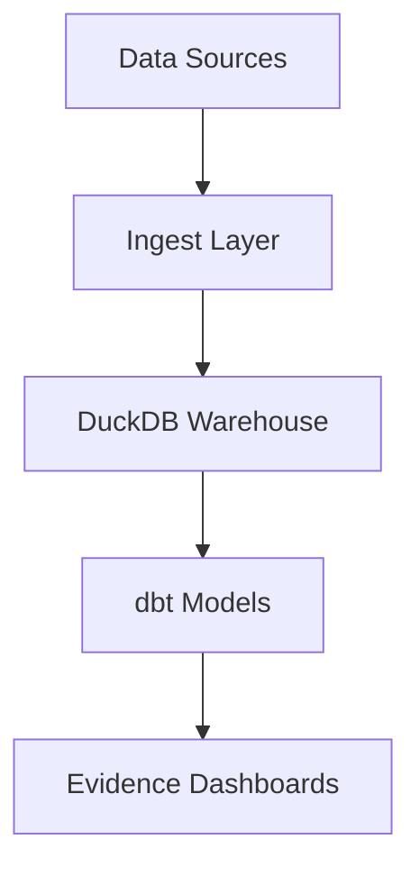

# ChessBI

ChessBI is a modern analytics platform for chess data, designed to deliver actionable insights for players, coaches, and analysts. Built on DuckDB, dbt, and Evidence, ChessBI transforms raw chess games into interactive dashboards and robust KPIs.

## Key Metrics

- **Win Rate**: Percentage of games won, segmented by opening, time control, color, and opponent rating.
- **Draw Rate**: Percentage of drawn games, with the same segmentations.
- **Loss Rate**: Percentage of lost games, with the same segmentations.
- **Opening Performance**: Win rates and frequency by ECO code and opening name.
- **Time Control Analysis**: Performance metrics across Bullet, Blitz, Rapid, and Classical games.
- **Color Advantage**: Win rate differential between playing as White vs. Black.
- **Opponent Rating Buckets**: Performance against Beginner (0-1199), Intermediate (1200-1599), Advanced (1600-1999), Expert (2000-2399), and Master (2400+) players.

For detailed KPI definitions, see [docs/kpis.md](docs/kpis.md).

## Architecture



## Roadmap

- [ ] Data Ingestion Pipeline (Chess.com API, Lichess API)
- [ ] DuckDB Warehouse Setup
- [ ] dbt Models for Core KPIs
- [ ] Evidence Dashboard Development
- [ ] CI/CD Pipeline Enhancement
- [ ] Performance Optimization
- [ ] Advanced Analytics (ELO modeling, opening theory)

## Ingestion (Chess.com)

To ingest chess game data from Chess.com:

```powershell
# Activate virtual environment first
.venv\Scripts\activate

# Ingest last 3 months for a user
python -c "from ingest.chesscom_ingest import run_chesscom_ingest; print(run_chesscom_ingest('USERNAME', max_months=3))"

# Ingest only months since 2024-01
python -c "from ingest.chesscom_ingest import run_chesscom_ingest; print(run_chesscom_ingest('USERNAME', max_months=12, since='2024-01'))"
```

Replace `USERNAME` with the Chess.com username to fetch. Raw JSON files are saved to `data/raw/chesscom/USERNAME/`.

## How to Run Locally

1. Clone the repository:
   ```bash
   git clone https://github.com/mariamji19-DataFairy/ChessBI.git
   cd ChessBI
   ```

2. Create a virtual environment:
   ```bash
   python -m venv .venv
   .venv\Scripts\activate  # On Windows
   ```

3. Install dependencies:
   ```bash
   pip install -r requirements.txt
   ```

4. Verify setup:
   ```bash
   python -c "import pandas, duckdb, requests, dotenv; print('All dependencies installed successfully')"
   ```

## License

MIT License. See [LICENSE](LICENSE).

## Author

Maintained by [mariamji19-DataFairy](https://github.com/mariamji19-DataFairy)
