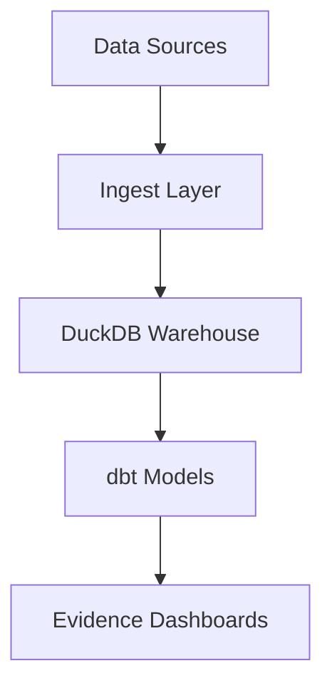

# ChessBI

ChessBI is a modern analytics platform for chess data, designed to deliver actionable insights for players, coaches, and analysts. Built on DuckDB, dbt, and Evidence, ChessBI transforms raw chess games into interactive dashboards and robust KPIs.

## Key Metrics

- **Win Rate**: Percentage of games won, segmented by opening, time control, color, and opponent rating.
- **Draw Rate**: Percentage of drawn games, with the same segmentations.
- **Loss Rate**: Percentage of lost games, with the same segmentations.
- **Opening Performance**: Win rates and frequency by ECO code and opening name.
- **Time Control Analysis**: Performance metrics across Bullet, Blitz, Rapid, and Classical games.
- **Color Advantage**: Win rate differential between playing as White vs. Black.
- **Opponent Rating Buckets**: Performance against Beginner (0-1199), Intermediate (1200-1599), Advanced (1600-1999), Expert (2000-2399), and Master (2400+) players.

For detailed KPI definitions, see [docs/kpis.md](docs/kpis.md).

## Architecture



## Roadmap

- [ ] Data Ingestion Pipeline (Chess.com API, Lichess API)
- [ ] DuckDB Warehouse Setup
- [ ] dbt Models for Core KPIs
- [ ] Evidence Dashboard Development
- [ ] CI/CD Pipeline Enhancement
- [ ] Performance Optimization
- [ ] Advanced Analytics (ELO modeling, opening theory)

## Dataset

This project uses chess game data for analytics. The workflow supports both a full dataset (for local development) and a committed sample (for CI/testing).

### Setup

1. **Place the full dataset** (not committed):
   ```
   data/raw/lichess/games.csv
   ```
   This directory is gitignored and won't be pushed to the repository.

2. **Generate a sample dataset** (committed for CI):
   ```powershell
   python scripts/prepare_dataset.py --input data/raw/lichess/games.csv --out data/sample/games_sample.csv --rows 2000
   ```
   This creates a 2000-row sample in `data/sample/` that is committed to the repo for automated testing.

3. **Load data into DuckDB**:
   ```powershell
   # Load from full dataset (local development)
   python warehouse/load_duckdb.py --db warehouse/chessbi.duckdb --source raw

   # Load from sample (CI/testing)
   python warehouse/load_duckdb.py --db warehouse/chessbi.duckdb --source sample
   ```

The loader creates:
- `raw_games` table with all CSV columns
- `raw_games_clean` view with standardized column types

**Note**: CI pipelines should use `--source sample` to work with the committed sample dataset.

## Ingestion (Chess.com)

To ingest chess game data from Chess.com, use the CLI:

```powershell
# Set user agent (recommended for API compliance)
$env:CHESSBI_USER_AGENT="ChessBI (contact: mariamji19-DataFairy)"

# Activate virtual environment
.venv\Scripts\activate

# Ingest last 3 months for a user
python -m ingest.cli chesscom --username YOUR_CHESSCOM_USERNAME --max-months 3

# Ingest only months since 2024-01
python -m ingest.cli chesscom --username YOUR_CHESSCOM_USERNAME --max-months 12 --since 2024-01

# Custom output directory
python -m ingest.cli chesscom --username YOUR_CHESSCOM_USERNAME --out custom/path --max-months 6
```

Raw JSON files are saved to `data/raw/chesscom/<username>/` (this directory is gitignored).

**Alternative (Python one-liner):**
```powershell
python -c "from ingest.chesscom_ingest import run_chesscom_ingest; print(run_chesscom_ingest('YOUR_CHESSCOM_USERNAME', max_months=3))"
```

## How to Run Locally

1. Clone the repository:
   ```bash
   git clone https://github.com/mariamji19-DataFairy/ChessBI.git
   cd ChessBI
   ```

2. Create a virtual environment:
   ```bash
   python -m venv .venv
   .venv\Scripts\activate  # On Windows
   ```

3. Install dependencies:
   ```bash
   pip install -r requirements.txt
   ```

4. Verify setup:
   ```bash
   python -c "import pandas, duckdb, requests, dotenv; print('All dependencies installed successfully')"
   ```

## License

MIT License. See [LICENSE](LICENSE).

## Author

Maintained by [mariamji19-DataFairy](https://github.com/mariamji19-DataFairy)
