# Architecture

ChessBI follows a modern data stack architecture optimized for analytics workloads. The platform ingests chess game data from various sources, transforms it using dbt, stores it in DuckDB for fast querying, and presents insights through Evidence dashboards.

```mermaid
flowchart LR
    subgraph Sources
        A[Chess.com API]
        B[Lichess API]
        C[PGN Files]
    end

    subgraph Ingestion
        D[Python Scripts]
        E[Data Validation]
    end

    subgraph Warehouse
        F[DuckDB Database]
        G[Raw Tables]
        H[Staging Tables]
    end

    subgraph Transformation
        I[dbt Models]
        J[KPI Calculations]
        K[Aggregations]
    end

    subgraph Presentation
        L[Evidence Dashboards]
        M[Interactive Reports]
        N[Scheduled Exports]
    end

    Sources --> Ingestion
    Ingestion --> Warehouse
    Warehouse --> Transformation
    Transformation --> Presentation
```

