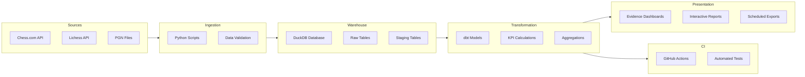

# Architecture

ChessBI follows a modern data stack architecture optimized for analytics workloads. The platform ingests chess game data from various sources, transforms it using dbt, stores it in DuckDB for fast querying, and presents insights through Evidence dashboards.

## System Diagram



## Layer Details

### Source Layer

**Purpose**: External chess platforms providing game data via APIs and file exports.

**Components**:
- **Chess.com API**: Public API with rate limiting (3 requests/second)
- **Lichess API**: Open database with bulk exports
- **PGN Files**: Portable Game Notation standard format

**Key considerations**:
- APIs require retry logic and ETag caching for efficiency
- Rate limits enforced through exponential backoff
- Data validation on ingestion (required fields, data types)

### Ingestion Layer

**Purpose**: Fetch, validate, and persist raw data from external sources.

**Components**:
- **Python API clients**: HTTP clients with retry/backoff logic (`ingest/chesscom_client.py`)
- **ETag caching**: Avoid re-downloading unchanged archives (`ingest/etag_cache.py`)
- **CLI interface**: User-friendly commands for data ingestion (`ingest/cli.py`)
- **Data validation**: Schema checks before writing to disk

**Output**: Raw JSON files in `data/raw/chesscom/<username>/` (gitignored).

**Key considerations**:
- Respect API rate limits to avoid bans
- Cache unchanged data to minimize bandwidth
- Validate data structure before persistence

### Warehouse Layer

**Purpose**: Store raw and cleaned data in queryable format.

**Components**:
- **DuckDB database**: Single-file embedded OLAP database (`warehouse/chessbi.duckdb`)
- **Raw tables**: `raw_games` with exact CSV structure
- **Clean views**: `raw_games_clean` with standardized types and column names

**Schema**:
```sql
CREATE TABLE raw_games (
    id VARCHAR,
    created_at BIGINT,
    white_id VARCHAR,
    black_id VARCHAR,
    white_rating INTEGER,
    black_rating INTEGER,
    winner VARCHAR,
    time_control VARCHAR,
    opening_eco VARCHAR,
    opening_name VARCHAR,
    turns INTEGER
);

CREATE VIEW raw_games_clean AS
SELECT
    id as game_id,
    epoch_ms(CAST(created_at AS BIGINT)) as created_at_ts,
    white_id as white_player_id,
    black_id as black_player_id,
    white_rating,
    black_rating,
    winner,
    time_control,
    opening_eco,
    opening_name,
    turns
FROM raw_games;
```

**Key considerations**:
- DuckDB provides PostgreSQL-compatible SQL
- Sample dataset (2000 rows) committed for CI
- Full dataset (20k+ rows) stays local, gitignored

### Transformation Layer

**Purpose**: Clean, standardize, and model data for analytics.

**Components**:
- **dbt project**: SQL-based transformations with testing (`dbt/`)
- **Staging models**: Data cleaning and deduplication (`models/staging/stg_games.sql`)
- **Mart models**: Dimensional model (fact + dimensions) (`models/marts/`)
- **Data tests**: Quality checks on uniqueness, nulls, valid enums

**Models**:
- `stg_games`: Cleaned games with standardized winner labels and deduplication
- `fact_games`: One row per game with all metrics
- `dim_player`: Unique players (union of white/black)
- `dim_opening`: Chess openings with surrogate key (ECO + name)
- `dim_time_control`: Time controls with parsed base/increment and category

**Data quality**:
- 18 tests (5 models + 13 data tests)
- All tests must pass for CI to succeed

**Key considerations**:
- Staging layer handles data quality issues (duplicates, nulls)
- Surrogate keys for dimensions with composite natural keys
- Incremental models possible (not yet implemented)

### Presentation Layer

**Purpose**: Deliver insights through interactive dashboards.

**Components** (planned):
- **Evidence dashboards**: Markdown + SQL for version-controlled BI
- **Static site generation**: HTML/CSS/JS output for hosting
- **Interactive charts**: Responsive visualizations without JavaScript coding

**Planned dashboards**:
1. Player performance (win/loss/draw rates by opening, time control, color)
2. Opening analysis (ECO code performance)
3. Rating progression over time
4. Opponent strength analysis

**Key considerations**:
- Dashboards defined in code (version controlled)
- Static output (no server required)
- Fast iteration with live reload

### CI/CD Layer

**Purpose**: Automated testing and validation on every commit.

**Components**:
- **GitHub Actions workflow**: `.github/workflows/ci.yml`
- **Sample data loading**: Test with 2000-row dataset
- **dbt build**: Run all models and tests
- **Test validation**: All tests must pass

**Workflow steps**:
1. Checkout code
2. Setup Python environment
3. Install dependencies (`requirements.txt`)
4. Load sample dataset into DuckDB
5. Run `dbt debug` (connection test)
6. Run `dbt build` (models + tests)
7. Verify 18/18 tests pass

**Key considerations**:
- Fast feedback (< 2 minutes total)
- Uses sample data (full dataset too large for CI)
- Prevents regressions in data quality

## Data Flow

```
1. API Request → Chess.com/Lichess
2. JSON Response → Python Ingestion Scripts
3. Raw Files → data/raw/chesscom/<user>/ (gitignored)
4. CSV Load → DuckDB raw_games table
5. dbt Source → raw_games_clean view
6. dbt Staging → stg_games view (cleaning)
7. dbt Marts → fact_games, dim_* tables
8. Evidence → Query marts for dashboards
9. GitHub Actions → Automated testing on commit
```

## Design Principles

1. **Local-first**: Everything runs on laptop, no cloud dependencies
2. **Version controlled**: Code, config, schema, and sample data in git
3. **Tested**: Automated data quality checks prevent regressions
4. **Modular**: Each layer has clear inputs/outputs
5. **Reproducible**: Clone, install, run—works everywhere

## Scalability Considerations

**Current scale** (portfolio project):
- 2,000 rows (sample) → 20,000 rows (local) → 1M rows (theoretical max)
- Query latency: < 100ms for analytical queries
- dbt build time: < 5 seconds

**Production upgrade path**:
- DuckDB → Snowflake/BigQuery (same SQL)
- Python scripts → Airflow/Dagster (orchestration)
- Evidence → Looker/Mode (enterprise BI)
- GitHub Actions → dbt Cloud (managed dbt)

**Key insight**: Architecture patterns are production-ready; tools scale independently.

## References

- [dbt Best Practices](https://docs.getdbt.com/guides/best-practices)
- [DuckDB Architecture](https://duckdb.org/why_duckdb)
- [Kimball Dimensional Modeling](https://www.kimballgroup.com/data-warehouse-business-intelligence-resources/kimball-techniques/dimensional-modeling-techniques/)

